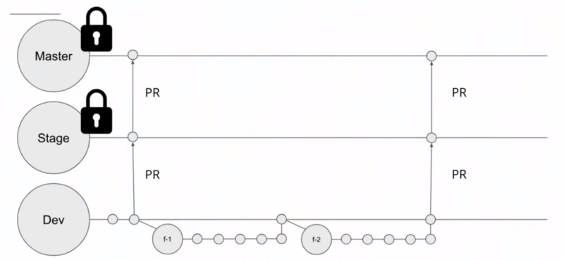

<h1 align="center">Welcome to TEAU ICT contributing guide</h1>

Thank you for investing your time in contributing to our projects!&#129321; Any contribution you make will be accounted for and accredited with your name showing up in the glorious contributors list.

Read our [Code of Conduct](CodeOfConduct.md) to keep our community approachable and respectable.

In this guide you will get an overview of the contribution workflow from opening an issue, creating a PR, reviewing, and merging the PR.

Use the table of contents icon  on the top left corner of this document to get to a specific section of this guide quickly.


## New contributor guide &#128221;
To get an overview of a project, read the README. Here are some resources to help you get started with making contributions:

- Finding ways to contribute
- Set up Git
- GitHub flow
- Collaborating with pull requests
- Collaborating as a contributor
  
## 🔗 Finding ways to contribute

If you'd like to contribute, start by searching through the issues and pull requests to see whether someone else has raised a similar idea or question. In adition, you can also check in the individual repository documentation (README) for the project roadmap. This will give you an overview of how to best contribute to the projects.

If you don't see your idea listed, and you think it fits into the goals of the guide, do one of the following:

- If your contribution is minor, such as a typo fix, open a pull request.
- If your contribution is major, such as a new guide, start by opening an issue first. That way, other people can weigh in on the discussion before you do any work.

## Set up Git
Learn how to set up Git in the [resources](Resources.md) section

## &#127826; Issues
Issues are used to track tasks that contributors can help with. If an issue has a triage label, we haven't reviewed it yet, and you shouldn't begin work on it.

If you've found something in the content or the website that should be updated, search open issues to see if someone else has reported the same thing. If it's something new, open an issue using a template. We'll use the issue to have a conversation about the problem you want to fix.


## &#128296;Pull Requests
A pull request is a way to suggest changes in our repositories. When we merge those changes, they should be deployed to the live application within 24 hours. All pull request must be made from a different branch other than the main branches. Ensure that your request has enough information indicating the changes and fixes that are being supplied for ease of review and merging.
Should you get a request for changes by a reviewer, please note that it is in good faith and in the best light for the projects. Reviewers are urged to always be accommodating hence your pull requests are in good hands.

- Direct commits to master and staging branches (even single-line modifications) are not allowed. Every modification has to come as a PR
- Anybody is welcome to provide comments to the PR (either direct comments or using the review feature offered by Github)
- PR can be merged when the following conditions are met:
    - All comment threads are closed
    - All the participants in the discussion have provided a LGTM general comment (LGTM = Looks good to me)
- PR should be of an appropriated size (in terms of codebase changes) that makes review achievable. Too large PRs could be closed with a "please, redo the work in smaller pieces" without any further discussing
- Ensure your commits are clear, comprehensive and describe what the code does, and are made in an appropriate branch as described in the branches section at the bottom of this page. Do not assume the reviewer will understand your changes.
- Once the pr is in, don't delete or close the branch.

## Contributions
- Direct contributions using contributor status reserve the same conditions as pull request.
- Self-merging is not allowed (except in rare and justified circumstances)
### Rule of Dos
1. Before contributing any code, the author must make sure the developed code adheres to the syntax guidelines enforced by the linters.
2. Code must be developed following the branching model and change log policies defined below.


# 🔗 Working with branches
The image below outlines the major idea of the working style. 
- Each Project contains three main branches
    - ```Master / Main```
    - ```Staging```
    - ```Development```
- We appreciate every contribution by our community. In the spirit of protecting those we love, we have extra protection on the codebases. Check out the pretty locks.
- The first two are only accessible to project maintainers who are responsible for controlling the reviewing, approving and merging of code into our codebase.
  The master branch contains our working code that should be live. The staging branch contains code that'll be tested to simulate it's performance in production. This is essentially a testing ground and is only available to select maintainers hence not much emphasis will be put here.




The development branch, on the other hand is amazing and we love this branch yay! &#128525; As a matter of fact, this is the branch we'll be using the most. 

In order to start developing a new feature or refactoring, a new branch should be created with name ft/<featureName> . This branch must be created from the current version of the development branch. Once the new functionality has been completed, a PR will be created from the feature branch to development. Remember to check both the linters and the tests before creating the PR.

Bugfixes work the same way as other tasks, with the exception of the branch name, that should be called bug/<bugName>


### Example
Let's say a open source contributor Developer-A is working on a ```feature-1```.
Developer-A creates a branch(```feature-1```) sourcing from the ```Development```  branch. Maybe this feature will be revolutionary, or maybe a security flaw is being patched.

This developer now requires to make a PR to the development branch awaiting a generous coffee from the reviewers. We love you Developer-A!!
Should Developer-B have another great idea for the project, they will create another branch ```feature-2``` stemming from Development branch and follow the same process.

All subsequent changes will be made in this manner for your own piece of mind and for the ease of review.

- Important terms to note:
    - CL(change list) -> This contains a list of items that a reviewer may require that you change.
    - LGTM(Looks Good To Me) -> This review, however short means that your code has passed review and looks good to the reviewer.
    - NiT(Not important) -> This may indicate a suggestion that does'nt really affect your code directly eg. a request to align coding styles or an addition to an idea.


